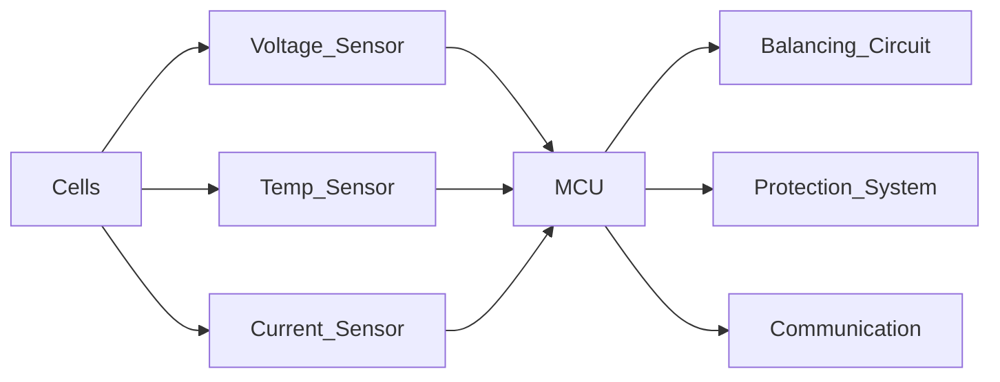
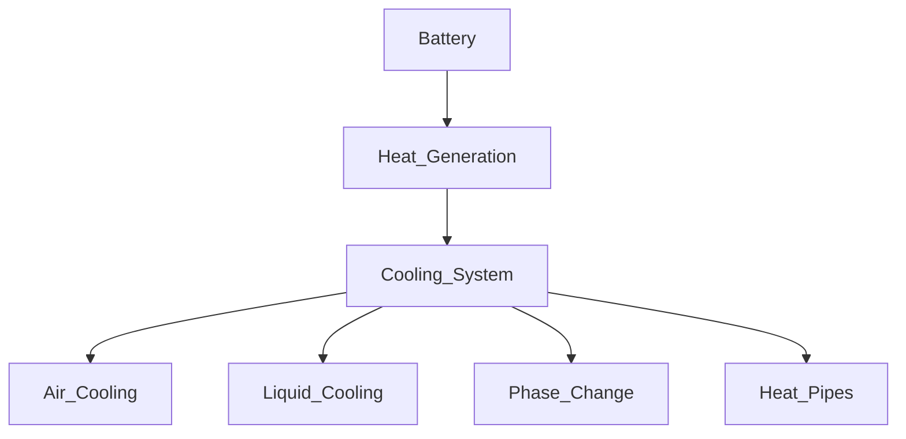
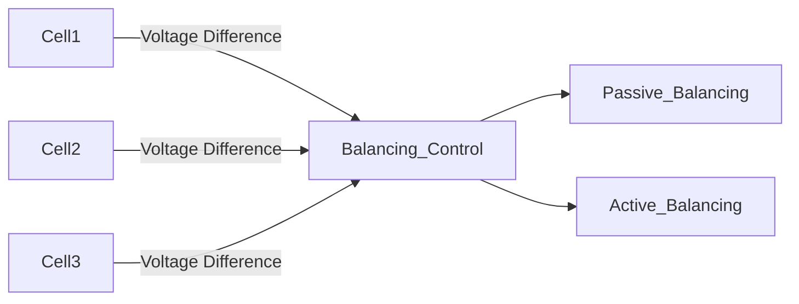
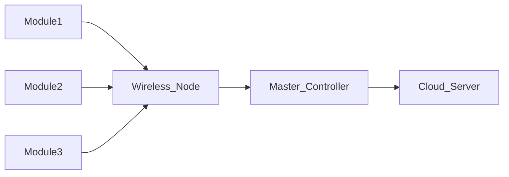
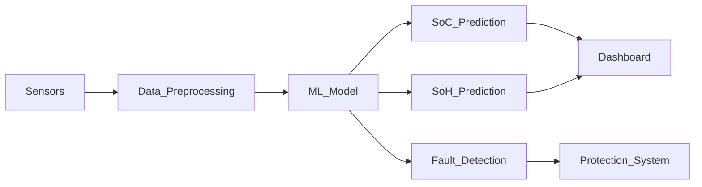

#  Battery Management System (BMS)
## Latest Trends & Role of AI/ML in Modern Energy Systems

---

#  Overview

A Battery Management System (BMS) is an electronic system that monitors, protects, and manages rechargeable battery packs, especially Lithium-ion batteries used in:

-  Electric Vehicles (EVs)
-  Renewable Energy Storage
-  Consumer Electronics
-  Industrial Backup Systems

The BMS ensures safety, performance, efficiency, and longer battery lifespan.

---

#  1️⃣ Basic Structure of a BMS

## 🔹 BMS Block Diagram

### Main Components:
- Cell Voltage Sensors
- Current Sensor
- Temperature Sensors
- Microcontroller (MCU)
- Cell Balancing Circuit
- Protection Circuit
- Communication Interface (CAN / IoT)

---

#  2️⃣ Core Functions of BMS

###  Monitoring
- Cell voltage
- Pack current
- Temperature

###  Protection
- Overcharge protection
- Over-discharge protection
- Overcurrent protection
- Short circuit protection
- Thermal protection

###  Optimization
- Cell balancing
- Battery life improvement
- Efficiency enhancement

---

#  3️⃣ Battery Thermal Management System (BTMS)

## 🔹 Thermal Management Diagram

Thermal management prevents overheating and improves battery lifespan and safety.

---

#  4️⃣ Cell Balancing System

## 🔹 Cell Balancing Concept

### Types:
- 🔹 Passive Balancing (energy dissipated as heat)
- 🔹 Active Balancing (energy transferred between cells)

---

#  5️⃣ Wireless BMS Architecture (Latest Trend)

Wireless BMS:
- Reduces wiring complexity
- Reduces vehicle weight
- Improves scalability
- Used in next-generation EVs

---

#  6️⃣ AI-Integrated Smart BMS Architecture

---

#  Latest Trends in BMS (2024–2026)

* Smart Embedded BMS  
* Wireless BMS (wBMS)  
* Cloud-connected Battery Monitoring  
* Digital Twin Battery Modeling  
* AI-Based SoC & SoH Estimation  
* Predictive Maintenance  

---

#  How AI / ML is Making a Difference

## AI in State of Charge (SoC)

Traditional BMS:
- Mathematical models
- Fixed equations

AI-Based BMS:
- Learns from voltage patterns
- Uses current history
- Considers temperature variations
- Improves accuracy

Models Used:
- Neural Networks
- Random Forest
- XGBoost
- LSTM (Time-series)

Result:
✔ More accurate battery percentage  
✔ Better EV range prediction  

---

##  AI for Fault Detection

AI detects:
- Internal short circuits
- Abnormal heating
- Voltage imbalance
- Early thermal runaway signs

Using:
- Anomaly detection
- Autoencoders
- Predictive analytics

---

##  AI for Battery Health (SoH)

AI predicts:
- Remaining Useful Life (RUL)
- Capacity fade
- Degradation trends

Helps:
- EV manufacturers
- Fleet operators
- Renewable energy storage systems

---

#  Example: AI-Based EV Battery System

---

#  Traditional vs AI-Based BMS

| Traditional BMS | AI-Integrated BMS |
|-----------------|------------------|
| Fixed thresholds | Adaptive learning |
| Reactive safety | Predictive safety |
| Limited estimation | High accuracy prediction |
| No data learning | Continuous learning |

---

#  Future Scope

- Self-learning battery systems  
- AI-based fast charging optimization  
- Federated learning for EV fleets  
- Smart grid integration  
- Digital twin battery systems  

---

#  Conclusion

Battery Management Systems are evolving from simple monitoring devices into intelligent AI-driven platforms.

AI/ML enhances:
- Accuracy
- Safety
- Battery lifespan
- Energy efficiency

AI-based BMS is one of the fastest-growing research areas in:

- Electric Vehicles
- Renewable Energy
- Smart Grid Systems
- Sustainable Technology

---

#  Prepared By
Srujan M H
AIML Student  

